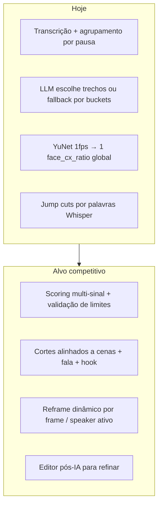

# Plano de Melhorias — Shorts/Reels/TikTok

> Elevar a qualidade dos clipes virais, dos timecodes de corte e do reframe 9:16, fechando as lacunas entre o pipeline atual (transcrição + LLM + YuNet estático) e ferramentas como Opus Clip e CapCut — aproveitando o roadmap já documentado em [PLANO_SHORTS_IA.md](PLANO_SHORTS_IA.md).

**Data:** 01/07/2026

---

## Tarefas de implementação

- [ ] Criar `selection/scorer.py` + `planner.py` com candidatos deslizantes, penalidades e snap a segmentos semânticos
- [ ] Implementar SceneDetectionSkill (PySceneDetect) e VADSkill (Silero) com artefatos `scenes.json` e `speech_regions.json`
- [ ] Refatorar `pipeline.py`: LLM rerank sobre top-N candidatos, score real no JSON, validação `MIN/MAX_CLIP_DURATION` e dedup
- [ ] YOLOv11n + ByteTrack + `crop_path.py` + `ffmpeg_svc.reframe_with_crop_path()`; recalcular crop por clipe
- [ ] Preview WYSIWYG com `face_cx_ratio` real, trim manual in/out, regenerar clipe individual, thumbnails
- [ ] Estender `shorts_benchmark_v2.py` com métricas objetivas de corte, crop e tempo de pipeline

---

## Diagnóstico: o que o app faz hoje vs. o que falta

O módulo Shorts já entrega um fluxo funcional: upload → análise local (Faster-Whisper + LM Studio) → lista de clipes → export 9:16 com jump cuts e legendas. Porém, **3 pilares ainda estão fracos** em relação a Opus Clip / CapCut:

| Pilar | Estado atual | Gap principal |
|-------|--------------|---------------|
| **Seleção viral** | Prompt LLM em [`web/shorts/pipeline.py`](web/shorts/pipeline.py) + fallback em [`web/shorts/utils.py`](web/shorts/utils.py) | Score **mockado** (`0.95 - idx * 0.05`); sem VAD, cenas, energia, diarização; sem validação de 15–60s |
| **Timecodes de corte** | Limites vêm só da transcrição | Cortes podem cair no meio de frase **e** no meio de cena visual; fallback distribui por tempo, não por conteúdo |
| **Crop inteligente** | YuNet amostra 1 fps → **um** `face_cx_ratio` em [`run_face_tracking_task()`](web/shorts/pipeline.py) | Sem tracking temporal, sem multi-speaker, preview CSS não reflete rosto real |

O documento [`PLANO_SHORTS_IA.md`](PLANO_SHORTS_IA.md) já descreve a arquitetura alvo (PySceneDetect, YOLO, ByteTrack, scorer composto). **~40% está implementado**; o plano abaixo prioriza o que mais move qualidade percebida.

---

## 1. Cortes mais inteligentes (maior impacto em “viralidade”)

### 1.1 Scorer composto antes do LLM (heurísticas reais)

Criar [`web/shorts/selection/scorer.py`](web/shorts/selection/scorer.py) e [`planner.py`](web/shorts/selection/planner.py) conforme o plano original:

**Sinais a combinar (pesos configuráveis):**

- **Densidade de fala** — palavras/segundo no intervalo (VAD + Whisper)
- **Coerência de cena** — clip inteiro dentro de 1 cena PySceneDetect (evita jump visual estranho)
- **Hook nos primeiros 3s** — pergunta, número, palavra forte, frase curta impactante
- **Fechamento limpo** — termina em fim de frase/parágrafo semântico (usar [`group_segments_semantically()`](web/shorts/utils.py))
- **Penalidades** — silêncio >2s no início, música/ruído `[...]`, trecho >60s ou <15s ([`MIN/MAX_CLIP_DURATION`](web/shorts/config.py) hoje **não são aplicados**)

**Fluxo proposto:**

O LLM deixa de ser o **único** selector e passa a **reranker** (como previsto na Fase 6 do plano) — mais previsível e debugável.

### 1.2 PySceneDetect para boundaries de corte

Implementar `SceneDetectionSkill` → artefato `scenes.json`:

- Usar `scenedetect` (CPU, leve) no vídeo inteiro
- **Snap** de `start_sec`/`end_sec` para o boundary de cena mais próximo (tolerância ~0.5s)
- Preferir candidatos que **não cruzam** mudança de cena

Integrar no pipeline entre transcrição e seleção ([`web/shorts/pipeline.py`](web/shorts/pipeline.py)), emitindo stage `shorts:scenes`.

### 1.3 Silero VAD complementar

Whisper sozinho erra pausas longas e ruído. Adicionar `VADSkill`:

- `speech_regions.json` via Silero VAD (ONNX, sem GPU)
- Cruzar com intervalos Whisper existentes em [`whisper_svc`](web/services/whisper_svc.py)
- Usar para: (a) boundaries de clip, (b) penalizar trechos com muito silêncio, (c) melhorar [`compute_silence_removed_intervals()`](web/shorts/render.py)

### 1.4 Prompt LLM mais estruturado + score real

Melhorias em [`pipeline.py`](web/shorts/pipeline.py) (~357–445):

- Pedir JSON com campos **`viral_score` (0–100)**, **`hook_text`**, **`why_viral`**, **`platform_fit`** (TikTok/Reels/Shorts)
- Alimentar o LLM só com **top-N candidatos pré-filtrados** pelo scorer (não a transcrição inteira de vídeos longos)
- Substituir scores mockados por score composto: `0.6 * heuristic + 0.4 * llm_score`
- Validar pós-LLM: clamp 15–60s, snap a segmentos/cenas, deduplicar clipes sobrepostos (>50% overlap)

### 1.5 Speaker diarization (podcasts multi-pessoa)

Para podcasts/tutorials com 2+ hosts:

- Integrar **pyannote** ou **whisperX** (diarização) como skill opcional
- Preferir trechos onde **um speaker domina** (menos confusão visual)
- Futuro: alternar crop entre speakers ativos por timestamp

---

## 2. Reframe 9:16 mais inteligente (crop “smart” de verdade)

### 2.1 De crop estático → crop path dinâmico

Estado atual: [`run_face_tracking_task()`](web/shorts/pipeline.py) retorna um único `face_cx_ratio` aplicado em [`render.py`](web/shorts/render.py) via FFmpeg `crop=...:crop_x:0`.

**Evolução (Fase 4 do plano):**

| Etapa | Tecnologia | Saída |
|-------|------------|-------|
| Detecção | YOLOv11n ONNX ([`YOLO_MODEL_URL`](web/shorts/config.py) já definido) | `detections.json` |
| Tracking | ByteTrack | `tracks.json` |
| Trajetória | OpenCV moving average | `crop_paths/{clip_id}.json` |
| Render | `ffmpeg_svc.reframe_with_crop_path()` | crop animado por keyframe |

Regras de composição (como Opus Clip):

- **1 pessoa**: centralizar rosto/corpo com margem superior (safe zone [`SAFE_ZONE_TOP`](web/shorts/config.py))
- **2 pessoas**: split layout ou alternar crop no speaker ativo (requer diarização)
- **Tela compartilhada / slides**: modo `blur` ou crop em região de interesse (detectar área estática)
- **Fallback**: center crop se confiança baixa

### 2.2 Crop por clipe, não global

Hoje `face_cx_ratio` é global ao vídeo. Deve ser **recalculado no intervalo `[start_sec, end_sec]`** de cada clipe — essencial quando o host muda de posição ou câmera corta.

### 2.3 Preview WYSIWYG

[`ShortsPreview.jsx`](web/frontend/src/features/shorts/ShortsPreview.jsx) simula smart crop em CSS sem usar `face_cx_ratio`. Melhorias:

- Exibir overlay com posição real detectada antes do render
- Após análise, mostrar thumbnail 9:16 por clipe (frame no hook)
- Reutilizar crop interativo do Editor Completo ([`App.jsx`](web/frontend/src/App.jsx) já tem `cropRect`) no fluxo Shorts

### 2.4 Modos de layout avançados

Além de `smart | blur | center`:

- **`split`** — duas pessoas empilhadas (comum em podcasts)
- **`screenshare`** — vídeo principal + inset do rosto
- **`safe-headroom`** — garantir que olhos ficam acima da linha de legendas TikTok

---

## 3. Jump cuts e ritmo (pós-produção automática)

[`compute_silence_removed_intervals()`](web/shorts/render.py) já remove silêncios — base sólida. Melhorias:

- **VAD-driven cuts**: cortar pausas >300ms (configurável), não só entre palavras
- **Breath padding adaptativo**: menos padding em trechos rápidos, mais em explicações
- **Evitar micro-cortes**: merge intervalos <200ms (causa flicker)
- **Preservar punchlines**: não cortar pausa dramática antes de punchline (detectar queda de energia seguida de pico)
- **NVENC** (`h264_nvenc`) para export 3–5× mais rápido em GPUs NVIDIA

---

## 4. UX e produto (fechar gap com CapCut/Opus Clip)

Melhorias de frontend com alto retorno:

| Feature | Onde | Por quê |
|---------|------|---------|
| **Trim manual in/out** | `ShortsClipList` + timeline mínima | Usuário corrige 10% dos cortes ruins |
| **Regenerar 1 clipe** | novo endpoint `POST /api/shorts/regenerate-clip` | Evita re-análise completa |
| **Editar headline/hashtags** | `ShortsClipList` | Opus Clip gera copy social |
| **Templates de legenda virais** | `preset_svc` + animações ASS | Karaoke, bounce, emoji keywords |
| **Score explicável** | UI mostra `why_viral` + sinais | Confiança do usuário |
| **Batch overnight** | fila asyncio + cancelamento robusto | Vídeos 2h+ |
| **Benchmark contínuo** | [`scripts/shorts_benchmark_v2.py`](scripts/shorts_benchmark_v2.py) | Medir qualidade antes/depois |

---

## 5. Roadmap priorizado por impacto

### Sprint A — Quick wins (1–2 semanas, sem GPU extra)

1. Aplicar `MIN/MAX_CLIP_DURATION` e snap a limites de segmentos
2. Implementar scorer heurístico + candidatos deslizantes
3. Integrar PySceneDetect (snap de boundaries)
4. LLM como reranker com score real no JSON
5. Recalcular `face_cx_ratio` **por clipe** (YuNet no intervalo do clip)
6. Preview smart usando ratio real

**Resultado esperado:** cortes mais coerentes, scores confiáveis, crop menos “errado” em vídeos longos.

### Sprint B — Reframe dinâmico (2–3 semanas)

1. YOLOv11n + ByteTrack → `tracks.json`
2. `crop_path.py` com suavização
3. `ffmpeg_svc.reframe_with_crop_path()`
4. Modo split para 2 pessoas

**Resultado esperado:** qualidade visual comparável a Opus Clip em podcasts talking-head.

### Sprint C — Produto e polish (1–2 semanas)

1. Trim manual + regenerar clipe
2. Thumbnails + copy social
3. Templates virais de legenda
4. NVENC + fila de export

### Sprint D — Diferenciação (contínuo)

1. Diarização multi-speaker
2. Detecção de slides/screenshare
3. A/B de hooks (gerar 2 variantes do mesmo trecho)
4. Métricas de benchmark automatizadas

---

## 6. Métricas de sucesso (como saber se melhorou)

Usar [`scripts/shorts_benchmark_v2.py`](scripts/shorts_benchmark_v2.py) estendido:

- **% clipes dentro de 15–60s** após validação
- **% clipes sem corte de cena no meio**
- **Desvio do crop** (distância rosto-centro do frame 9:16)
- **Tempo até primeiro clipe pronto**
- **Avaliação humana** (escala 1–5: hook, fechamento, enquadramento) em 10 vídeos de teste fixos

---

## Arquivos principais a modificar

| Arquivo | Mudança |
|---------|---------|
| [`web/shorts/pipeline.py`](web/shorts/pipeline.py) | Novas skills (VAD, scenes), scorer, LLM rerank |
| [`web/shorts/utils.py`](web/shorts/utils.py) | Candidatos deslizantes, validação, dedup |
| **Novo** `web/shorts/selection/scorer.py` | Score composto |
| **Novo** `web/shorts/skills/scene_detection.py` | PySceneDetect |
| **Novo** `web/shorts/skills/vad.py` | Silero VAD |
| **Novo** `web/shorts/reframe/crop_path.py` | Trajetória dinâmica |
| [`web/shorts/render.py`](web/shorts/render.py) | Crop path + VAD cuts |
| [`web/services/ffmpeg_svc.py`](web/services/ffmpeg_svc.py) | `reframe_with_crop_path`, NVENC |
| [`web/frontend/src/features/shorts/*`](web/frontend/src/features/shorts/) | Trim, preview real, score explicável |

---

## Resumo executivo

Para competir com Opus Clip e CapCut neste app **100% local**, o maior ROI está em:

1. **Deixar de confiar só no LLM** — scorer multi-sinal + PySceneDetect + validação rígida de limites
2. **Crop dinâmico por clipe** — YOLO + ByteTrack + crop path suavizado (YuNet global é insuficiente)
3. **Editor pós-IA mínimo** — trim manual, regenerar 1 clipe, preview WYSIWYG

O esqueleto (transcrição, export, legendas, wizard) já existe; falta implementar as **skills de visão e seleção** previstas no [`PLANO_SHORTS_IA.md`](PLANO_SHORTS_IA.md) e corrigir gaps concretos (scores mockados, duração não validada, crop global).
