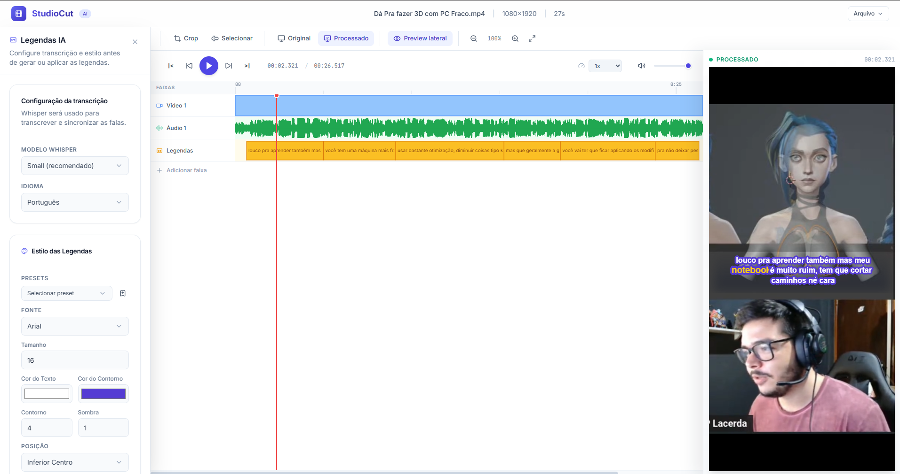

# Guepardosys Caption Studio 🎬✨

O **Guepardosys Caption Studio** (anteriormente *remove-silence*) é um editor de vídeo inteligente para desktop projetado para otimizar e automatizar tarefas complexas de pós-produção. Com inteligência artificial rodando 100% localmente, ele remove trechos silenciosos, gera transcrições automáticas de fala e renderiza legendas estilizadas de forma rápida e segura.



---

## 🚀 Principais Vantagens

- **100% Pronto para Uso (Self-Contained):** O instalador já vem com **FFmpeg** e **FFprobe embutidos**. O usuário final não precisa rodar comandos no terminal, baixar arquivos extras ou configurar variáveis de ambiente (PATH) do sistema. É só instalar e começar a editar!
- **Totalmente Local e Privado:** Todo o processamento de áudio, transcrição (Whisper local) e edição de vídeo ocorre diretamente na máquina do usuário. Seus arquivos de vídeo nunca são enviados para servidores externos ou para a nuvem.
- **Remoção de Silêncio por IA:** Analisa e recorta com precisão milimétrica trechos mudos ou sem fala no vídeo, economizando horas de edição manual.
- **Legenda Rápida e Personalizada:** Transcreve áudio com alta precisão e permite escolher fontes, tamanhos, cores de contorno, destaques e posicionamento para as legendas queimadas (*hardsub*).
- **Exportação Nativa Amigável:** Salve o vídeo final utilizando a janela nativa do seu sistema operacional. O aplicativo sugere automaticamente nomes inteligentes, baseando-se no arquivo original e adicionando o sufixo `-legendado` (ex: `aula_01-legendado.mp4`).

---

## 📥 Como Baixar e Instalar (Usuários Finais)

Para fazer o download do instalador oficial do Guepardosys Caption Studio:

1. Acesse a seção de **Releases** no repositório GitHub do projeto:
   👉 **[Baixar Guepardosys Caption Studio - GitHub Releases](https://github.com/dougkusanagi/remove-silence/releases)**
2. Baixe o instalador adequado para o seu sistema operacional:
   - **Windows (.exe):** `guepardosys-caption-studio_0.1.0_x64-setup.exe` (Recomendado)
   - **Windows (.msi):** `guepardosys-caption-studio_0.1.0_x64_en-US.msi` (Corporativo)
3. Execute o instalador baixado e siga as instruções simples na tela para concluir a instalação. O aplicativo estará disponível no menu Iniciar.

---

## 💻 Instalação e Desenvolvimento (Para Programadores)

Se você é desenvolvedor e deseja compilar o aplicativo ou testar modificações localmente:

### Requisitos do Sistema
- **Python 3.10 ou superior**
- **Node.js** com gerenciador **Bun** (recomendado para maior velocidade de build)
- Utilitário **`uv`** do Python instalado (`pip install uv`)

### Configuração Inicial

1. **Clone o repositório:**
   ```bash
   git clone https://github.com/dougkusanagi/remove-silence.git
   cd remove-silence
   ```

2. **Crie o ambiente virtual do Python e instale as dependências:**
   ```bash
   # Cria o ambiente virtual
   uv venv
   # Instala as dependências Python
   uv sync
   # Instala dependências do frontend React e Tauri
   bun install
   ```

3. **Inicie o servidor de desenvolvimento (Frontend + Backend):**
   ```bash
   bun run dev
   ```

4. **Gerar builds e instaladores locais:**
   ```bash
   # Compila o frontend, empacota o backend com PyInstaller e gera os instaladores nativos do Tauri
   bun run build && bun run build:backend && bun run tauri build
   ```

---

## 🛠️ Tecnologias Utilizadas

- **Frontend:** React + Vite, estilizado com Tailwind CSS para uma interface moderna e responsiva.
- **Backend:** FastAPI (Python) rodando localmente na porta 3000.
- **Motor de Transcrição:** OpenAI Whisper executando nativamente em hardware local.
- **Motor de Vídeo:** Subprocessos do FFmpeg e FFprobe empacotados.
- **Desktop Shell:** Tauri v2 (Rust) gerando executáveis eficientes de alta performance e baixo consumo de RAM.
